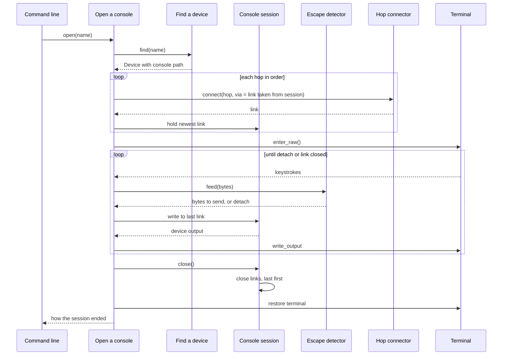
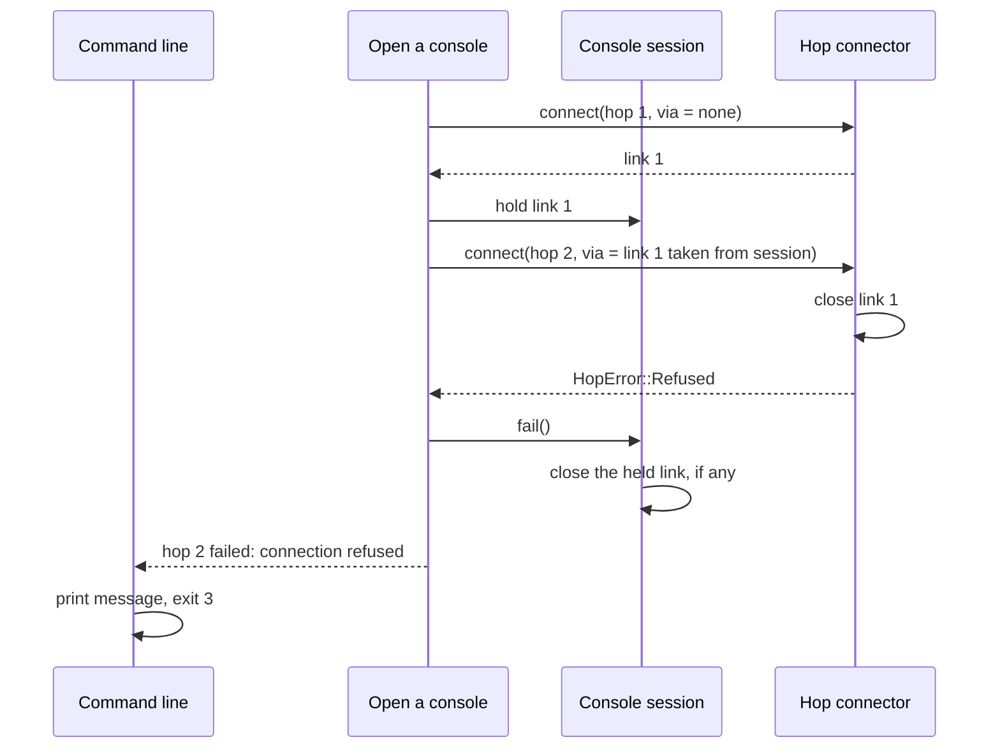

# Feature: Open a console

## Intent

"I want to type `consolectl open lab-router` and be on its console, whether it's on the USB serial adapter on my desk or two SSH hops away. When I'm done, one key sequence gets me out and my terminal is back to normal. When it can't connect, tell me exactly which hop failed."

For engineers at a terminal. It must work on macOS and Linux with no `ssh` or `picocom` installed.

Out of scope:

- Serial ports attached to a jump host (the remote-serial feature).
- Running a command without an interactive session (the run-commands feature).
- Reconnecting automatically after a dropped link.

## Settled decisions

- D1: The escape sequence is `Ctrl-]` then `q` (familiar from telnet, and rarely needed by device consoles)
- D2: Each hop gets 10 seconds to connect before it fails as a timeout (long enough for slow lab jump hosts; configurable later if needed)
- D3: A hop failure exits with code 3, separate from configuration errors at code 2 (the user overrode the suggestion to reuse code 2, so that scripts can tell "fix your config" from "the network is down")
- D4: Unknown SSH host keys are refused with a message naming the `ssh-keyscan` command to run (vision constraint; no trust-on-first-use prompt)

## Adopt or build

| Component | Decision | Choice | Reason |
| --- | --- | --- | --- |
| Serial I/O | adopt | `tokio-serial` | Maintained async wrapper over `serialport`, supports macOS and Linux |
| SSH client | adopt | `russh` | Runs over any async stream, so jump hosts need no subprocess (ADR-2026-09-24-hop-chains) |
| Raw terminal | adopt | `crossterm` | Raw mode and input handling on both platforms |
| Name suggestions | adopt | `strsim` | Edit distance is solved; 0 transitive dependencies |
| Escape detection | build | | Two-key domain rule of about 30 lines; no library models it |

## Spec delta

### ADDED CAPABILITY access: Console access
Opening consoles on configured devices.

### ADDED REQ-access.open-console: Open a device console
The CLI SHALL connect the user's terminal to the console of a configured device through every hop of its console path, in order, relay bytes both ways unchanged, and restore the terminal when the session ends.

#### SCN-access.direct-serial: Console on a local serial port
- GIVEN device `lab-router` has console path `serial /dev/ttyUSB0 115200 8N1`
- AND the device answers a carriage return with `lab-router login: `
- WHEN the user runs `consolectl open lab-router` and presses Enter
- THEN the terminal shows `lab-router login: ` within 2 seconds

#### SCN-access.ssh-direct: Console over one SSH hop
- GIVEN device `core-switch` has console path `ssh admin@10.0.0.2:22`
- AND the SSH agent holds a key that `admin@10.0.0.2` accepts, and `10.0.0.2` is in `known_hosts`
- WHEN the user runs `consolectl open core-switch`
- THEN the terminal shows the remote prompt `core-switch#` within 5 seconds

#### SCN-access.ssh-through-jump-host: Console through a jump host
- GIVEN device `core-switch` has console path `ssh ops@jump1.lab:22` then `ssh admin@10.0.0.2:22`
- AND `10.0.0.2` accepts connections only from `jump1.lab`
- WHEN the user runs `consolectl open core-switch`
- THEN the terminal shows the remote prompt `core-switch#` within 5 seconds
- AND the only network connection from the user's machine goes to `jump1.lab:22`

#### SCN-access.detach: Detach with the escape sequence
- GIVEN an open console session on `lab-router`
- WHEN the user presses `Ctrl-]` then `q`
- THEN every hop is closed, last hop first
- AND the terminal returns to the mode it had before the session
- AND the CLI prints `detached from lab-router` and exits with code 0

#### SCN-access.escape-not-completed: Escape key followed by another key
- GIVEN an open console session on `lab-router`
- WHEN the user presses `Ctrl-]` then `x`
- THEN the device receives the bytes `0x1d 0x78`, in that order
- AND the session stays open

### ADDED REQ-access.hop-failure: Report the hop that failed
When a hop cannot be opened, the CLI MUST close every hop already opened, last first, name the failing hop by its position and summary, and exit with code 3. It SHALL NOT leave the terminal in raw mode.

#### SCN-access.serial-busy: Serial port in use
- GIVEN `/dev/ttyUSB0` is held open exclusively by another process
- WHEN the user runs `consolectl open lab-router`
- THEN the CLI prints `hop 1 (serial /dev/ttyUSB0 115200 8N1) failed: device busy`
- AND it exits with code 3 and the terminal mode is unchanged

#### SCN-access.second-hop-refused: Second SSH hop refused
- GIVEN device `core-switch` has console path `ssh ops@jump1.lab:22` then `ssh admin@10.0.0.2:22`
- AND `10.0.0.2` refuses connections on port 22
- WHEN the user runs `consolectl open core-switch`
- THEN the CLI prints `hop 2 (ssh admin@10.0.0.2) failed: connection refused`
- AND the SSH connection to `jump1.lab` is closed before the CLI exits with code 3

### ADDED REQ-access.unknown-device: Suggest names for unknown devices
When asked to open a device that isn't configured, the CLI SHALL name up to three configured devices within edit distance 2 of the requested name, and exit with code 2.

#### SCN-access.unknown-device-suggestion: Misspelled device name
- GIVEN the configured devices are `lab-router` and `lab-switch`
- WHEN the user runs `consolectl open lab-ruoter`
- THEN the CLI prints `unknown device lab-ruoter; did you mean lab-router?`
- AND it exits with code 2

## Architecture delta

### MODIFIED ENT-access.console-session: Console session
- Kind: entity
- States: `opening` to `open` to `closed`, or to `failed` from `opening` or `open`
- Invariants:
  - the session holds only the newest link; closing it closes every link beneath, last first, in every end state
  - input reaches the last link only while the session is `open`
  - keystrokes pass through ENT-access.escape-detector before reaching a link
- Relationships:
  - opens ENT-inventory.console-path (1)
  - owns ENT-access.escape-detector (1)
- Module: MOD-access.domain
- File: `src/access/domain/console_session.rs`

### ADDED ENT-access.escape-detector: Escape detector
- Kind: value
- States: `idle`, and `armed` after `0x1d` (`Ctrl-]`)
- Invariants:
  - in `idle`, `0x1d` is held back and the detector becomes `armed`; every other byte passes through
  - in `armed`, `q` means detach; any other byte releases `0x1d` followed by that byte, and the detector returns to `idle`
- Module: MOD-access.domain
- File: `src/access/domain/escape_detector.rs`

### MODIFIED UC-access.open-console: Open a console
- Input: a device name
- Output: how the session ended: detached, closed by the device, or link lost
- Errors: unknown device, with suggestions; a hop failed, with the hop's position, summary and reason; no usable terminal
- Uses: UC-inventory.find-device, PORT-access.hop-connector, PORT-access.terminal
- Serves: REQ-access.open-console, REQ-access.hop-failure, REQ-access.unknown-device
- Module: MOD-access.app
- File: `src/access/app/open_console.rs`

### MODIFIED PORT-access.hop-connector: Hop connector
- Direction: driven
- Operations:
  - `async fn connect(&self, hop: &Hop, via: Option<Link>) -> Result<Link, HopError>`: opens one hop within 10 seconds, running over `via` when given, and returns its link. It takes ownership of `via`: on success the new link closes it; on failure `connect` closes it before returning. `HopError` is one of `Busy`, `NotFound`, `PermissionDenied`, `Refused`, `Unreachable`, `Timeout`, `AuthFailed`, `HostKeyUnknown` or `HostKeyMismatch`, each carrying a one-line reason.
- Implemented by: ADP-access.serial-connector, ADP-access.ssh-connector
- Module: MOD-access.app
- File: `src/access/app/ports/hop_connector.rs`

### MODIFIED FLOW-access.open-console: Open a console
- Serves: SCN-access.direct-serial, SCN-access.ssh-through-jump-host, SCN-access.detach, SCN-access.escape-not-completed
- Elements: ADP-system.cli, UC-access.open-console, UC-inventory.find-device, ENT-access.console-session, ENT-access.escape-detector, PORT-access.hop-connector, PORT-access.terminal

### ADDED FLOW-access.hop-failure: A hop fails to open
- Serves: SCN-access.second-hop-refused, SCN-access.serial-busy
- Elements: ADP-system.cli, UC-access.open-console, ENT-access.console-session, PORT-access.hop-connector

### MODIFIED ADP-system.cli: Command line
- Drives: UC-inventory.list-devices, UC-access.open-console
- Technology: command-line arguments, human output on stdout, JSON with `--json`; exit code 0 on success, 2 for configuration and usage errors, 3 for connection failures
- Adopts: `clap`, for argument parsing and help
- Module: MOD-system.cli
- File:
  - `src/cli/args.rs`
  - `src/cli/list.rs`
  - `src/cli/open.rs`
  - `src/cli/output.rs`

## Changes

| Change | Delivers | Builds | Depends on |
| --- | --- | --- | --- |
| 01-local-serial | SCN-access.direct-serial, SCN-access.detach, SCN-access.escape-not-completed, SCN-access.serial-busy, SCN-access.unknown-device-suggestion | ENT-access.console-session, ENT-access.escape-detector, UC-inventory.find-device, UC-access.open-console, PORT-access.console-link, PORT-access.hop-connector, PORT-access.terminal, ADP-access.serial-connector, ADP-access.raw-terminal, ADP-system.cli, FLOW-access.open-console, MOD-access.domain, MOD-access.app, MOD-access.adapters | |
| 02-ssh-hops | SCN-access.ssh-direct, SCN-access.ssh-through-jump-host, SCN-access.second-hop-refused | ADP-access.ssh-connector, FLOW-access.hop-failure | 01-local-serial |

<!-- cruze:managed -->
## Progress
- 01-local-serial: planned
- 02-ssh-hops: not started
<!-- /cruze:managed -->
