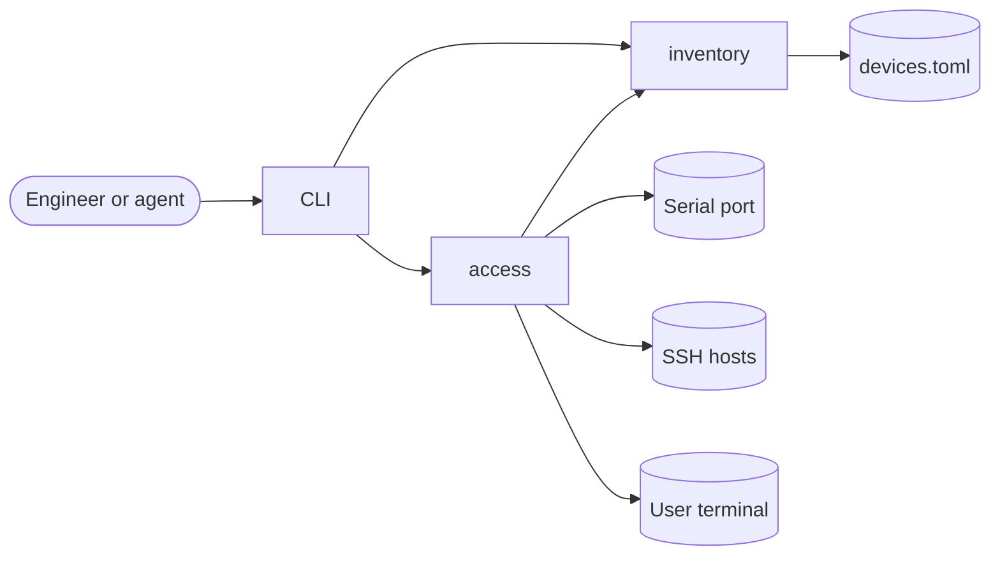
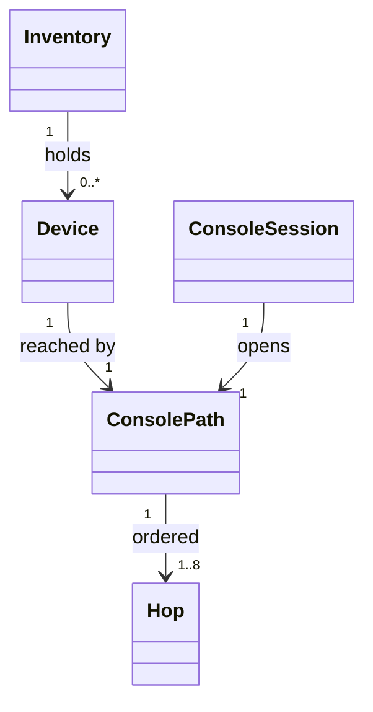
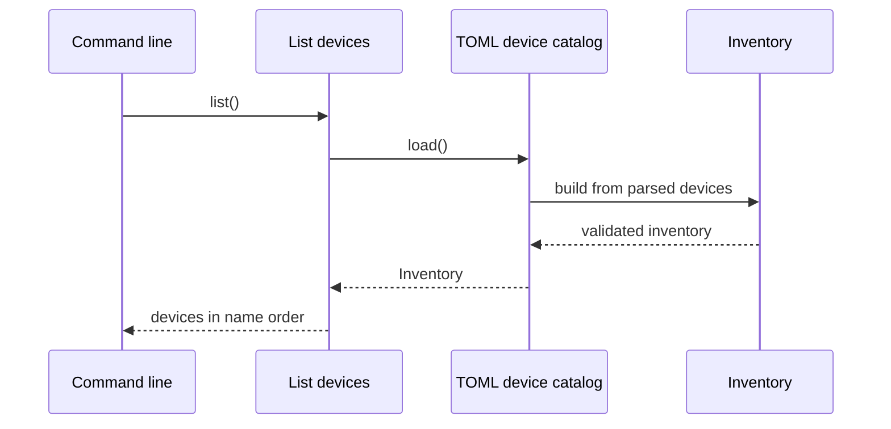
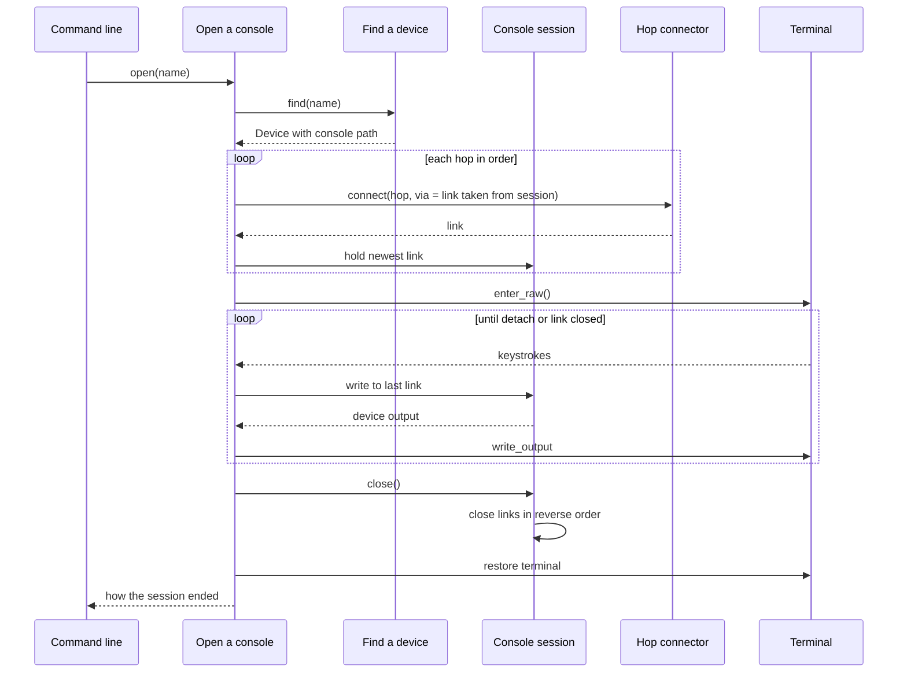

# Architecture: Console Access

## Overview

`consolectl` is a single Rust binary with a hexagonal design. Two bounded contexts hold the domain: `inventory` knows the configured devices and their console paths, and `access` opens console sessions over those paths. A CLI adapter drives the use cases, and adapters behind driven ports speak TOML, serial, SSH and the terminal. Only the composition root in `main.rs` builds adapters.

### VIEW-context: System context

## Bounded contexts

### CTX-inventory: Inventory
- Purpose: load, validate and look up the configured devices and their console paths
- Owns:
  - ENT-inventory.inventory, ENT-inventory.device, ENT-inventory.console-path, ENT-inventory.hop
  - UC-inventory.list-devices, UC-inventory.find-device
  - PORT-inventory.device-catalog
- Depends on: nothing

### CTX-access: Access
- Purpose: open console sessions over console paths, and run commands on them
- Owns:
  - ENT-access.console-session
  - UC-access.open-console, UC-access.run-command
  - PORT-access.hop-connector, PORT-access.console-link, PORT-access.terminal
- Depends on: CTX-inventory, for UC-inventory.find-device and the console path types it returns

## Domain model

### VIEW-domain-model: Domain model

### ENT-inventory.inventory: Inventory
- Kind: aggregate
- Invariants:
  - device names are unique
  - lookup is by exact name
- Relationships:
  - holds ENT-inventory.device (0..*)
- Module: MOD-inventory.domain
- File: `src/inventory/domain/inventory.rs`
- Status: built

### ENT-inventory.device: Device
- Kind: entity
- Invariants:
  - the name is 1 to 64 characters of lowercase letters, digits and hyphens
- Relationships:
  - reached by ENT-inventory.console-path (1)
- Module: MOD-inventory.domain
- File: `src/inventory/domain/device.rs`
- Status: built

### ENT-inventory.console-path: Console path
- Kind: value
- Invariants:
  - it has 1 to 8 hops
  - a serial hop can only be the last hop
- Relationships:
  - ordered ENT-inventory.hop (1..8)
- Module: MOD-inventory.domain
- File: `src/inventory/domain/console_path.rs`
- Status: built

### ENT-inventory.hop: Hop
- Kind: value
- Invariants:
  - an SSH hop has a host, a port from 1 to 65535, a user and an optional identity file
  - a serial hop has a device path, a standard baud rate and a framing such as `8N1`
- Module: MOD-inventory.domain
- File: `src/inventory/domain/hop.rs`
- Status: built

### ENT-access.console-session: Console session
- Kind: entity
- States: `opening` to `open` to `closed`, or to `failed` from either
- Invariants:
  - links are closed in the reverse order they were opened
- Relationships:
  - opens ENT-inventory.console-path (1)
- Module: MOD-access.domain
- File: `src/access/domain/console_session.rs`
- Status: planned

## Use cases

### UC-inventory.list-devices: List devices
- Input: none
- Output: every device in name order, with its name, description and a one-line console path summary
- Errors: the configuration is missing, unreadable or invalid, with the file location of the problem
- Uses: PORT-inventory.device-catalog
- Module: MOD-inventory.app
- File: `src/inventory/app/list_devices.rs`
- Status: built

### UC-inventory.find-device: Find a device
- Input: a device name
- Output: the device, with its console path
- Errors: unknown device, with up to 3 configured names within edit distance 2; the configuration errors of UC-inventory.list-devices
- Uses: PORT-inventory.device-catalog
- Module: MOD-inventory.app
- File: `src/inventory/app/find_device.rs`
- Status: planned

### UC-access.open-console: Open a console
- Input: a device name
- Output: how the session ended: detached, closed by the device, or link lost
- Errors: unknown device; a hop failed, with the hop's position, summary and reason; no usable terminal
- Uses: UC-inventory.find-device, PORT-access.hop-connector, PORT-access.terminal
- Module: MOD-access.app
- File: `src/access/app/open_console.rs`
- Status: planned

### UC-access.run-command: Run a command
- Input: a device name, a command line and a timeout
- Output: the command's output, and whether it ended at the device prompt or at the timeout
- Errors: those of UC-access.open-console; the timeout passed before any output
- Uses: UC-inventory.find-device, PORT-access.hop-connector
- Module: MOD-access.app
- File: `src/access/app/run_command.rs`
- Status: planned

## Ports

### PORT-inventory.device-catalog: Device catalog
- Direction: driven
- Operations:
  - `fn load(&self) -> Result<Inventory, CatalogError>`: reads the whole configuration and returns a validated inventory, or fails with `Missing`, `Unreadable` or `Invalid` (with a file location). It never returns a partial inventory.
- Implemented by: ADP-inventory.toml-catalog
- Module: MOD-inventory.app
- File: `src/inventory/app/ports/device_catalog.rs`
- Status: built

### PORT-access.hop-connector: Hop connector
- Direction: driven
- Operations:
  - `async fn connect(&self, hop: &Hop, via: Option<Link>) -> Result<Link, HopError>`: opens one hop, running over `via` when given, and returns its link
- Implemented by: ADP-access.serial-connector, ADP-access.ssh-connector
- Module: MOD-access.app
- File: `src/access/app/ports/hop_connector.rs`
- Status: planned

### PORT-access.console-link: Console link
- Direction: driven
- Operations:
  - `async fn read(&mut self, buf: &mut [u8]) -> Result<usize, LinkError>`: returns bytes from the device; 0 means the far end closed
  - `async fn write_all(&mut self, bytes: &[u8]) -> Result<(), LinkError>`: sends every byte or fails
  - `async fn close(self: Box<Self>)`: closes this link, then the link it runs over; it never fails and is safe after an error
- Module: MOD-access.app
- File: `src/access/app/ports/console_link.rs`
- Status: planned

### PORT-access.terminal: Terminal
- Direction: driven
- Operations:
  - `fn enter_raw(&mut self) -> Result<RawMode, TerminalError>`: switches the user's terminal to raw mode; dropping `RawMode` restores it, including on panic
  - `async fn read_input(&mut self, buf: &mut [u8]) -> Result<usize, TerminalError>`: keystrokes from the user
  - `async fn write_output(&mut self, bytes: &[u8]) -> Result<(), TerminalError>`: bytes to the screen
- Implemented by: ADP-access.raw-terminal
- Module: MOD-access.app
- File: `src/access/app/ports/terminal.rs`
- Status: planned

## Adapters

### ADP-inventory.toml-catalog: TOML device catalog
- Implements: PORT-inventory.device-catalog
- Technology: a TOML file found at `--config`, then `$CONSOLECTL_CONFIG`, then `$XDG_CONFIG_HOME/consolectl/devices.toml`
- Adopts: `toml` with `serde`, because parsing and error locations are solved problems
- Module: MOD-inventory.adapters
- File: `src/inventory/adapters/toml_catalog.rs`
- Status: built

### ADP-access.serial-connector: Serial connector
- Implements: PORT-access.hop-connector, for serial hops without a `via` link
- Technology: local serial ports
- Adopts: `tokio-serial`, the maintained async wrapper over `serialport`
- Future: serial hops behind an SSH hop run a bridge command over the SSH link (remote-serial feature)
- Module: MOD-access.adapters
- File: `src/access/adapters/serial_connector.rs`
- Status: planned

### ADP-access.ssh-connector: SSH connector
- Implements: PORT-access.hop-connector, for SSH hops, over a `via` link for hops after a jump host
- Technology: SSH with keys from the SSH agent or the hop's identity file; host keys checked against `known_hosts`
- Adopts: `russh`, which runs over any async stream, so jump hosts need no subprocess
- Module: MOD-access.adapters
- File: `src/access/adapters/ssh_connector.rs`
- Status: planned

### ADP-access.raw-terminal: Raw terminal
- Implements: PORT-access.terminal
- Technology: the controlling terminal of the process
- Adopts: `crossterm`, for raw mode and input on macOS and Linux
- Module: MOD-access.adapters
- File: `src/access/adapters/raw_terminal.rs`
- Status: planned

### ADP-system.cli: Command line
- Drives: UC-inventory.list-devices
- Technology: command-line arguments, human output on stdout, JSON with `--json`
- Adopts: `clap`, for argument parsing and help
- Module: MOD-system.cli
- File:
  - `src/cli/args.rs`
  - `src/cli/list.rs`
  - `src/cli/output.rs`
- Status: built

## Flows

### FLOW-inventory.list-devices: List devices
- Serves: SCN-inventory.list-configured, SCN-inventory.no-config
- Elements: ADP-system.cli, UC-inventory.list-devices, PORT-inventory.device-catalog, ADP-inventory.toml-catalog, ENT-inventory.inventory
- Status: built

### FLOW-access.open-console: Open a console
- Elements: ADP-system.cli, UC-access.open-console, UC-inventory.find-device, ENT-access.console-session, PORT-access.hop-connector, PORT-access.terminal
- Status: planned

## Modules

### MOD-inventory.domain: Inventory domain
- Path: `src/inventory/domain/`
- Layer: domain
- Owns: ENT-inventory.inventory, ENT-inventory.device, ENT-inventory.console-path, ENT-inventory.hop
- Status: built

### MOD-inventory.app: Inventory application
- Path: `src/inventory/app/`
- Layer: application
- Owns: UC-inventory.list-devices, UC-inventory.find-device, PORT-inventory.device-catalog
- Status: built

### MOD-inventory.adapters: Inventory adapters
- Path: `src/inventory/adapters/`
- Layer: adapter
- Owns: ADP-inventory.toml-catalog
- Status: built

### MOD-access.domain: Access domain
- Path: `src/access/domain/`
- Layer: domain
- Owns: ENT-access.console-session
- Status: planned

### MOD-access.app: Access application
- Path: `src/access/app/`
- Layer: application
- Owns: UC-access.open-console, UC-access.run-command, PORT-access.hop-connector, PORT-access.console-link, PORT-access.terminal
- Status: planned

### MOD-access.adapters: Access adapters
- Path: `src/access/adapters/`
- Layer: adapter
- Owns: ADP-access.serial-connector, ADP-access.ssh-connector, ADP-access.raw-terminal
- Status: planned

### MOD-system.cli: Command line
- Path: `src/cli/`
- Layer: adapter
- Owns: ADP-system.cli
- Status: built

### MOD-system.main: Composition root
- Path:
  - `src/main.rs`
  - `src/lib.rs`
- Layer: composition
- Owns: the wiring; `main.rs` builds every adapter and use case, and `lib.rs` only declares modules
- Status: built

## Dependency rules

### RULE-inward: Dependencies point inward
Domain modules import only domain modules. Application modules import domain modules and define the ports they use. Adapter modules import application and domain modules, never each other.
- Enforced by: inventory-domain, inventory-app, inventory-adapters, access-domain, access-app, access-adapters, cli

### RULE-context-direction: Access depends on inventory, never the reverse
The access context may use inventory's domain types and its use cases. Nothing in inventory imports access.
- Enforced by: access-domain, access-app, access-adapters

### RULE-composition: Only the composition root builds adapters
`main.rs` constructs every adapter and hands use cases to the CLI. No other module constructs an adapter.
- Enforced by: main

## Cross-cutting concerns

### XC-errors: Errors
Each layer has its own error enum built with `thiserror`, and each boundary translates the layer below's errors into its own. The CLI turns errors into one message and a non-zero exit code; `anyhow` is used only in `main.rs`.

### XC-configuration: Configuration
One TOML file, found in the order listed under ADP-inventory.toml-catalog. Only that adapter reads it. Secrets are never stored in it.

### XC-concurrency: Concurrency
`main.rs` starts a single-threaded Tokio runtime. Ports that do I/O are async. Domain code is synchronous and does no I/O.

### XC-terminal-safety: Terminal safety
The user's terminal is always restored when a session ends, fails or panics. `RawMode` restores on drop, and `main.rs` installs a panic hook that restores it too.

### XC-delivery: Build and delivery
`cargo fmt --check`, `cargo clippy -- -D warnings`, `cargo test`, `cruze check` and `cruze trace` run on every push in GitHub Actions (`.github/workflows/ci.yml`), on macOS and Linux. `make check` (`Makefile`) runs the same steps locally.

## Decisions

- ADR-2026-09-24-hop-chains: console paths are ordered hop chains, each hop connected over the previous link, instead of delegating to OpenSSH `ProxyJump`
