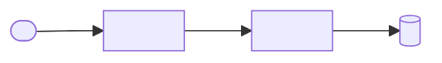
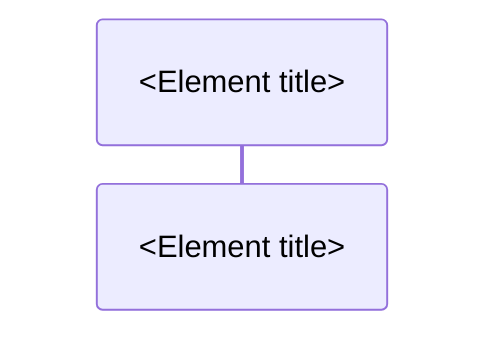

# Architecture: {{project_name}}

## Overview

<One paragraph: what the system is, how it is used, and the architectural style.>

### VIEW-context: System context



## Bounded contexts

### CTX-<name>: <Context title>
- Purpose: <what this context is responsible for>
- Owns:
  - <ENT, UC and PORT IDs>
- Depends on: <CTX ID and what it uses, or "nothing">

## Domain model

### VIEW-domain-model: Domain model

```mermaid
classDiagram
  class <Entity>
```

### ENT-<context>.<name>: <Entity title>
- Kind: <aggregate | entity | value>
- Invariants:
  - <a rule that always holds>
- Relationships:
  - <verb> <ENT ID> (<cardinality>)
- Module: <MOD ID>
- File: `<path>`

## Use cases

### UC-<context>.<name>: <Use case title>
- Input: <what the caller provides>
- Output: <what the caller gets>
- Errors: <each failure the caller can see>
- Uses: <PORT IDs>
- Module: <MOD ID>
- File: `<path>`

## Ports

### PORT-<context>.<name>: <Port title>
- Direction: <driven | driving>
- Operations:
  - `<signature>`: <guarantee; failure cases; who owns cleanup>
- Implemented by: <ADP IDs>
- Module: <MOD ID>
- File: `<path>`

## Adapters

### ADP-<context>.<name>: <Adapter title>
- Implements: <PORT ID>
- Technology: <library, protocol or system>
- Adopts: <library, and why adopt rather than build>
- Module: <MOD ID>
- File: `<path>`

## Flows

### FLOW-<context>.<name>: <Flow title>
- Serves: <SCN IDs>
- Elements: <IDs of every participant>



## Modules

### MOD-<context>.<name>: <Module title>
- Path: `<directory or file>`
- Layer: <domain | application | adapter | composition>
- Owns: <element IDs>

## Dependency rules

### RULE-<name>: <Rule title>
<One or two sentences stating what may depend on what.>
- Enforced by: <config layer names>

## Cross-cutting concerns

### XC-<name>: <Concern title>
<How the system handles it, and where.>

## Decisions

- ADR-<stem>: <one-line summary>
